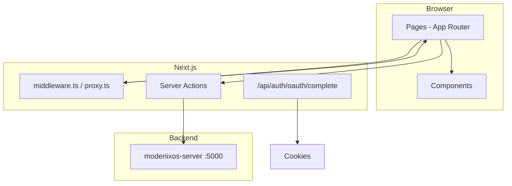

# Project Overview

[← Back to index](README.md)

## Purpose

**modenixos-client** is the Next.js 15 frontend for ModenixOS. It provides:

1. **Marketing site** — landing page and demo
2. **Platform auth** — login, register, OAuth, email verification
3. **Store owner dashboard** — catalog, orders, analytics, billing, store settings
4. **Platform admin panel** — store management, subscriptions, commission
5. **Public storefronts** — customer-facing shops at `/store/{slug}`

All data mutations and reads go to **modenixos-server** via Server Actions and API calls.

---

## Core UI features

### Authentication UI

- Email/password login and registration
- Google OAuth (`/google/callback`)
- Email verification (OTP)
- Forgot / reset password
- Forced password change when `needPasswordChange` is set
- Profile editing (`/profile`)

### Store owner dashboard (`/dashboard`)

| Section | Routes |
|---------|--------|
| Overview | `/dashboard`, `/dashboard/analytics` |
| Catalog | `/dashboard/products`, `/categories`, `/collections` |
| Commerce | `/dashboard/orders`, `/customers`, `/reviews`, `/coupons` |
| Shop setup | `/dashboard/store/*` (branding, theme, header, pages, shipping, appearance) |
| System | `/dashboard/settings`, `/settings/billing`, `/settings/users` |

### Platform admin (`/admin`)

| Section | Routes |
|---------|--------|
| Dashboard | `/admin/dashboard` |
| Management | `/admin/admin-management`, `/admin/subscriptions`, `/admin/commission` |
| Settings | `/admin/dashboard/settings`, `/admin/settings` |

### Public storefront (`/store/[slug]`)

| Page | Route |
|------|-------|
| Home | `/store/{slug}` |
| Shop | `/store/{slug}/shop` |
| Category | `/store/{slug}/categories/{categorySlug}` |
| Collection | `/store/{slug}/collections/{collectionSlug}` |
| Product | `/store/{slug}/products/{id}` |
| Cart / Checkout | `/store/{slug}/cart`, `/checkout` |
| Customer account | `/store/{slug}/account/*` |
| Order tracking | `/store/{slug}/track` |
| Policies | `/about`, `/contact-us`, `/privacy-policy`, etc. |

### Storefront themes

Two templates (from `components/modules/storefront/themes/registry.ts`):

| ID | Label |
|----|-------|
| `theme1` | Classic Retail |
| `theme2` | Editorial |

Selected via store `theme.templateId` in the API.

---

## User roles & routing

| Role | Default redirect | Protected prefix |
|------|------------------|------------------|
| `CLIENT` | `/dashboard` | `/dashboard/*` |
| `ADMIN` | `/admin/dashboard` | `/admin/*` |
| `SUPER_ADMIN` | `/admin/dashboard` | `/admin/*` (+ admin management) |

Clients without a store are redirected to `/onboarding`.

---

## Architecture (client)

---

## Business workflow (UI perspective)

1. User registers → verify email → onboarding (create store)
2. Owner configures store in dashboard → publishes store
3. Customers visit `/store/{slug}` → browse → cart → checkout
4. Owner fulfills orders in `/dashboard/orders`
5. Owner upgrades plan in `/dashboard/settings/billing`

---

## Related documentation

- [Pages & Routes](06-pages-and-routes.md)
- [Authentication](07-authentication.md)
- **modenixos-server** repository -> `docs/08-api-documentation.md`
