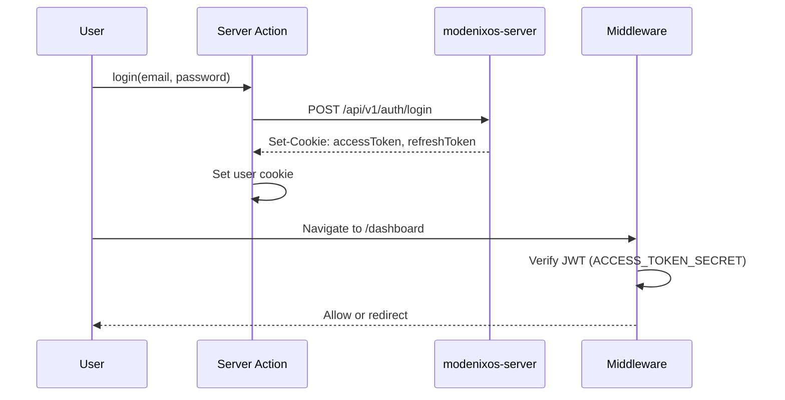

# Authentication

[← Back to index](README.md)

Client auth is implemented via **Edge middleware** (`src/proxy.ts`, exported from `src/middleware.ts`) and **Server Actions** in `src/actions/authActions/`.

Backend auth is handled by modenixos-server — see **modenixos-server** repository -> `docs/07-authentication.md`.

---

## Auth flow

---

## Cookies

| Cookie | Set by | Purpose |
|--------|--------|---------|
| `accessToken` | Server (HTTP-only) | API authentication |
| `refreshToken` | Server (HTTP-only) | Token refresh |
| `user` | Client Server Action | Role, email, flags for middleware fast path |
| `better-auth.session_token` | Better Auth | Session fallback |

Storefront customers use separate per-slug cookies (managed in storefront actions).

---

## Middleware rules (`proxy.ts`)

| Rule | Behavior |
|------|----------|
| Public routes | `/store/*`, `/`, `/demo` — no auth check |
| Auth pages | Logged-in users redirected to role dashboard |
| Protected routes | No valid JWT → redirect `/login?redirect=...` |
| Email not verified | Redirect `/verify-email` |
| `needPasswordChange` | Redirect `/reset-password` |
| CLIENT without store | Redirect `/onboarding` |
| Wrong role | Redirect to user's dashboard |

### Route ownership (`lib/authUtils.ts`)

| Owner | Paths |
|-------|-------|
| `CLIENT` | `/dashboard/*` |
| `ADMIN` | `/admin/*` (SUPER_ADMIN also allowed) |
| `COMMON` | `/profile`, `/onboarding`, `/invite/*` |
| `null` (public) | Storefront, landing, auth pages |

---

## Token refresh

Middleware auto-refreshes when:

- Access token missing or invalid
- Access token expiring within 60 seconds

Uses `refreshTokensFromRequest` → `POST /api/v1/auth/refresh-token`.

Soft navigations (RSC prefetch) use a fast path when JWT is fresh.

---

## Google OAuth

1. User clicks Google login → server `/api/v1/auth/login/google`
2. Redirect chain completes at `/google/callback`
3. Client calls `/api/v1/auth/oauth/code`
4. `POST /api/auth/oauth/complete` sets cookies (`src/app/api/auth/oauth/complete/route.ts`)

---

## Server Actions (auth)

| File | Purpose |
|------|---------|
| `_loginAction.ts` | Email/password login |
| `_registerAction.ts` | Registration |
| `_verifyEmailAction.ts` | OTP verification |
| `_forgotPasswordAction.ts` | Request reset |
| `_resetPasswordAction.ts` | Reset password |
| `_updateProfileAction.ts` | Profile update |
| `_syncAuthUserAction.ts` | Sync user cookie from API |
| `_getCurrentUserAction.ts` | Fetch current user |

---

## Store check cache

`hasStore` cookie caches whether CLIENT owns a store to avoid API calls on every navigation.

Functions: `lib/middlewareStoreCheck.ts`, `lib/hasStoreCookie.ts`.

---

## Related documentation

- [API Integration](08-api-integration.md)
- [Environment Variables](04-environment-variables.md)
- **modenixos-server** repository -> `docs/07-authentication.md`
