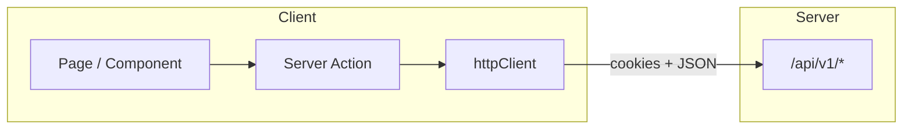

# API Integration

[← Back to index](README.md)

The client does not implement business APIs locally. All data flows through **modenixos-server** at `NEXT_PUBLIC_API_BASE_URL`.

Full endpoint reference: **modenixos-server** repository -> `docs/08-api-documentation.md`.

---

## HTTP client

**`src/lib/axios/httpClient.ts`**

- Axios instance with `baseURL` from `NEXT_PUBLIC_API_BASE_URL`
- Forwards cookies on server-side requests
- Used by Server Actions and server components

---

## Server Actions

| Action file | Server endpoints used |
|-------------|----------------------|
| `authActions/*` | `/auth/*` |
| `catalog.actions.ts` | `/products`, `/categories`, `/collections` |
| `store.actions.ts` | `/stores/*` |
| `billing.actions.ts` | `/billing/*` |
| `payment.actions.ts` | `/public/stores/:slug/payment/create` |
| `storefront-customer.actions.ts` | `/public/stores/:slug/customers/*` |
| `storefront-orders.actions.ts` | `/public/stores/:slug/orders` |
| `commission.actions.ts` | `/admin/commission/*` |
| `shop-users.actions.ts` | `/stores/me/members` |

Server Actions run on the Next.js server and forward the user's cookies to the API.

---

## Public storefront API

Storefront pages fetch from `/api/v1/public/stores/{slug}/...`:

| Client helper | Endpoint |
|---------------|----------|
| `lib/storefrontCustomerApi.ts` | Customer auth, wishlist |
| Page server components | Store, products, categories via actions or direct fetch |

No platform auth cookie required for public catalog. Customer features use storefront JWT cookies.

---

## Response format

Expect server response shape:

```json
{
  "success": true,
  "message": "...",
  "data": {},
  "meta": {}
}
```

Errors:

```json
{
  "success": false,
  "statusCode": 400,
  "message": "...",
  "errorSources": []
}
```

---

## Chatbot (landing page)

**`src/lib/chatbot/client.ts`**

- `GET /public/chat/config`
- `POST /public/chat`

Requires `NEXT_PUBLIC_API_BASE_URL`.

---

## File uploads

Branding and product images upload via Server Actions → multipart requests to server endpoints. Server uploads to Cloudinary.

**`src/lib/uploadStoreBranding.ts`** — store logo/banner uploads.

---

## Integration diagram



---

## Related documentation

- **modenixos-server** repository -> `docs/08-api-documentation.md`
- [Authentication](07-authentication.md)
